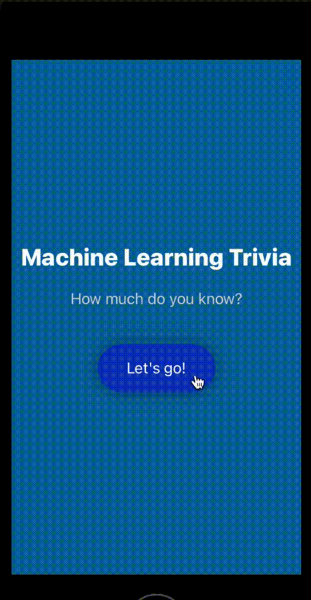

# [iOS Machine Learning Trivia App](https://www.youtube.com/watch?v=2poM3gUFFVw&list=PLuGq_O7Y2F2vyal8hGXL9yvRF8MJySG6m&index=3)

## Demonstration

## About
Trying to refresh my skills after a 3 year hiatus from iOS app development, I decided to use Swift to create a Machine Learning Trivia app. 

Inspired by the following repository: https://github.com/stephdiep/TriviaGameApp
